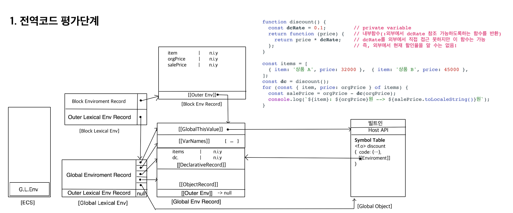

# Execute Context

### 각 레코드의 내장슬롯

**Global Environment Record**

-   [[ObjectRecord]] : 전역객체 참조
-   [[DeclarativeRecord]] : let, const로 선언된 식별자
-   [[GlobalThisValue]] :전역 스코프의 this의 반환값
-   [[VarNames]]
-   [[OuterEnv]] : 외부 Environment Record에 대한 참조 (G.E.R은 항상 null)

**Function Environment Record**

-   [[FunctionObject]] : Function Object에 대한 참조
-   [[NewTarget]] : 생성자 함수(or Class)로 호출한 경우 Function Object에 대한 참조 (아닌 경우는 undefined)
-   [[ThisValue]] : 함수 호출할 때 사용되는 this 값. this를 바인딩하지 않으면 default로 Global Object를 참조

    ```
    fn.call({id : 1}) //fn()함수 내의 this는 {id :1}
    ```

-   [[ThisBindingStatus]] : 값이 lexical이면 이 함수는 화살표 함수이며 local this를 갖지 않는다. lexical이 아니라면 uninitialized 상태였다가 [[ThisValue]]값이 set되면 initialized 상태로 변경
-   [[OuterEnv]] : Function Object의 [[Environment]]내부 슬롯이 참조하는 값. 즉, <f.o>가 생성될 당시의 lexical scope

Block Environment Record

### 코드의 실행 컨텍스트 그려보기

```javascript
function discount() {
    const dcRate = 0.1; // private variable
    return function (price) {
        // 내부함수(:외부에서 dcRate 참조 가능하도록하는 함수를 반환)
        return price * dcRate; // dcRate를 외부에서 직접 접근 못하지만 이 함수는 가능
    }; // 즉, 외부에서 현재 할인율을 알 수는 없음!
}

const items = [
    { item: "상품 A", price: 32000 },
    { item: "상품 B", price: 45000 },
];
const dc = discount();
for (const { item, price: orgPrice } of items) {
    const salePrice = orgPrice - dc(orgPrice);
    console.log(`${item}: ${orgPrice}원 --> ${salePrice.toLocaleString()}원`);
}
```




// 2개 더 그리기(for문 포함)
