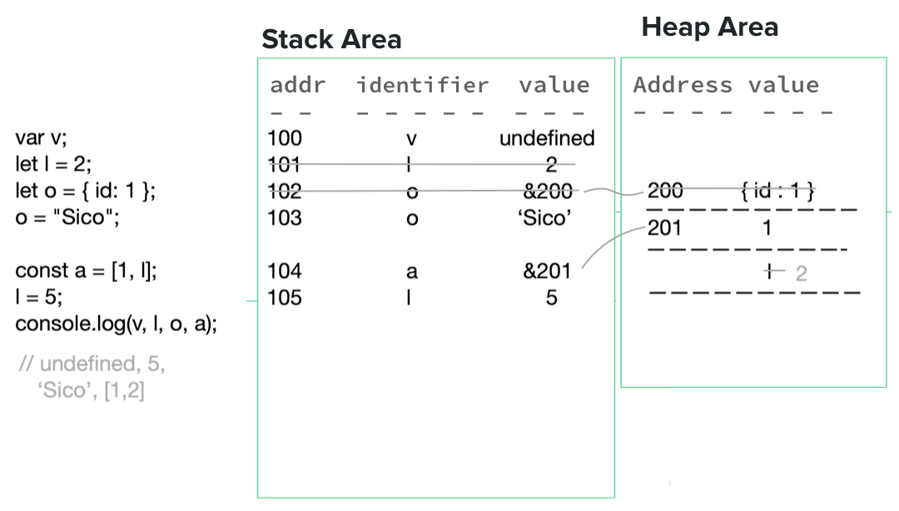

### 다음 변수들의 논리적 메모리(Stack & Heap) 모델을 그려보자.

```javascript
var v;
let l = 2;
let o = { id: 1 };
o = "Sico";
const a = [1, l];
l = 5;
console.log(v, l, o, a);
```



1. `var v;` : primitive값인 v는 선언되지 않았으므로 undefined로 stack에 저장된다.
2. `let l = 2;` : l은 primitive값인 2를 stack에 저장한다.
3. `let o = { id : 1}` : o는 reference값인 {id :1}를 Heap에 저장한다.
4. `o = 'Sico'` : o는 재정의되므로 기존 저장된 메모리에서 삭제되고 새로운 메모리에 저장된다. 기존 저장된 메모리가 삭제되므로 참조된 heap의 메모리도 gc 대상이 된다. 재정의한 o의 값인 'Sico'는 primitive값이므로 stack에 저장한다.
5. `const a = [1, l]` : a는 reference값인 [1, l]를 Heap에 저장한다.l는 Primitive한 값으로 복제되어 2가 된다.

6. `l = 5` : l은 재정의되므로 기존 저장된 메모리에서 삭제되고 새로운 메모리에 저장된다. 재정의한 l의 값인 5는 primitive한 값이므로 stack에 저장된다.
7. `console.log(v, l, o, a)` // undefined 5 Sico [ 1, 2 ]
