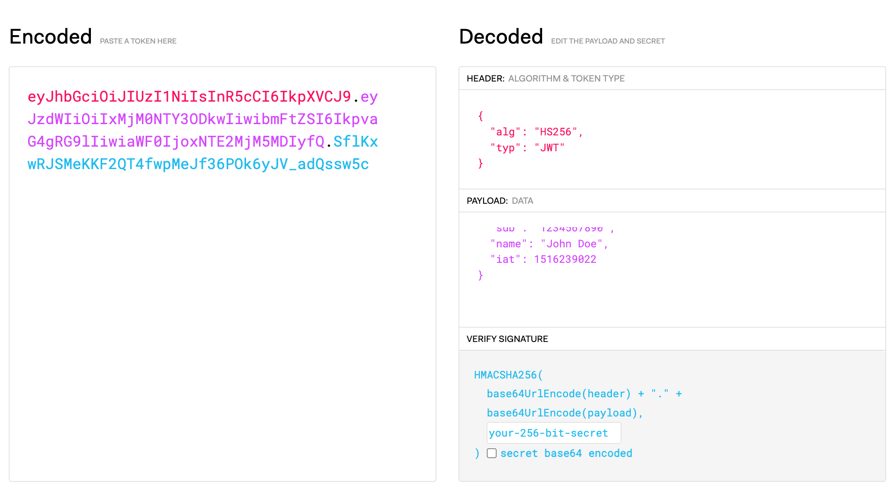
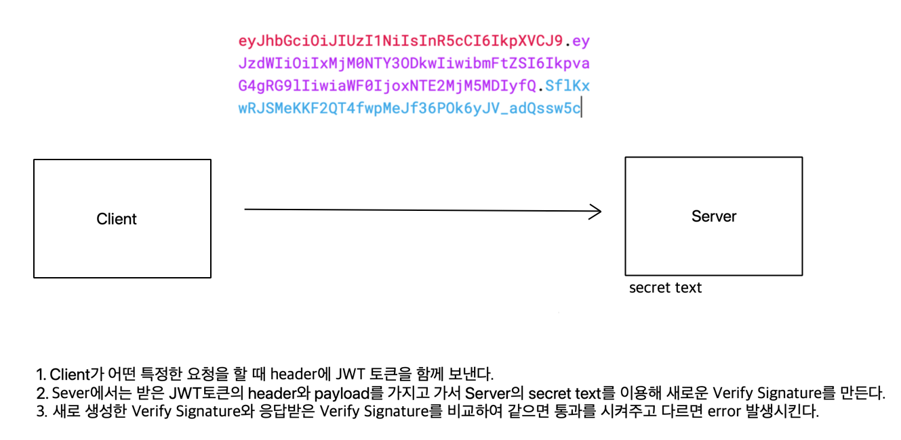
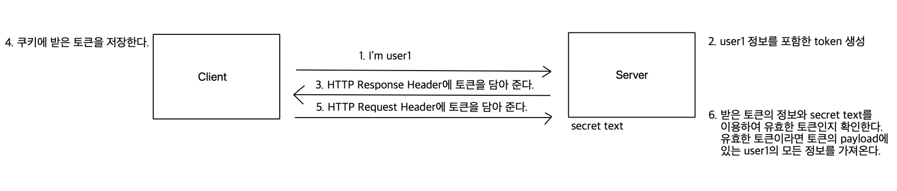

# JWT (JSON Web Token)

-   JWT : 정보를 안전하게 전달하기 위한 작은 크기의 토큰으로, 일반적으로 인증 및 정보 교환에 사용된다.
-   사용이유 : 웹에서 사용자가 로그인을 할 때마다 서버가 사용자를 기억하게 하려면 전통적으로는 세션을 사용했다. 사용자가 로그인하면, 서버는 사용자에 대한 세션을 생성하고 이 세션의 ID를 사용자의 브라우저에 쿠키로 저장했다. 그러나, 세션 정보 저장을 위한 메모리 공간 부족, 여러 서버의 운영시 어떤 서버에서 생성된 세션을 다른 서버에서 인식하지 못하는 등의 문제점이 발생되었고 이를 해결하기 위한 방법 중 하나로 JWT가 생겨났다. JWT는 사용자 정보를 토큰 형태로 클라이언트에게 저장하므로 서버는 상태를 유지할 필요가 없다.

-   구조
    -   header : 토큰에 대한 메타데이터 포함 (토큰 타입, 암호화 알고리즘 정보 [sha256, rsa...])
    -   payload : 실제로 전달하고자 하는 데이터 (유저 정보, 만료기간, 주제 등등)
    -   verify signature : 인코딩한 header와 인코딩한 Payload의 정보를 합친 후 secret text와 함께 암호화 알고리즘을 이용하여 암호화해서 만든 서명
    -   3가지 부분을 합치면 'Header.Payload.Signature' 형태의 문자열이 된다.
         출처 : [jwt.io](https://jwt.io/)
-   작동방식

    1. 사용자가 아이디와 비밀번호로 로그인 시도한다.
    2. 서버는 아이디와 비밀번호가 맞다는 JWT를 생성한다.
    3. 생성된 JWT를 사용자에게 전달합니다.
    4. 사용자는 이후 요청에 이 JWT를 포함해서 서버에 전달한다. 일반적으로 HTTP 헤더의 Authorization 부분에 넣어서 전달한다.
    5. 서버는 JWT가 유효한지 확인하고 맞다면 해당 사용자의 요청을 처리한다.

        

        

-   장점
    -   상태를 유지하지 않아도 되므로 서버의 부하가 감소한다.
    -   분산 시스템에서도 잘 동작한다.
-   단점
    -   한번 발행하면 변경이 불가능하므로 토큰의 만료 시간을 짧게 설정하거나 특별한 처리가 필요하다.
    -   payload의 정보는 누구나 볼 수 있으므로 민감한 정보를 포함시키지 않아야 한다.
    -   패킷을 가로채거나 토큰을 취득하게되면 데이터를 확인할 수 있다. 이를 해결하기 위해 JWE(Json Web Encryption)을 통해 암호화한다.
        -   JWE와 JWT의 차이점 : JWT는 데이터를 암호화하지 않고 데이터의 무결성만을 확인할 수 있는 서명을 포함하지만 JWE는 데이터를 암호화하여 데이터의 기밀성을 보장한다.
