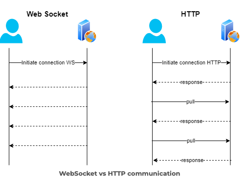

# HTTP & WebSocket


## 차이점  
### HTTP 프로토콜

-   (단방향)클라이언트가 서버에 요청을 보내면 서버는 응답만 보낸다.
-   (stateless) 응답을 보내면 연결이 끊긴다. 누가 보냈는지 상태를 유지하기 위해서는 쿠키나 세션 등을 사용해야한다.
-   클라이언트와 서버 간 통신은 주로 브라우저-백엔드 간이지만, 백엔드-백엔드 간 통신도 가능하다.

### WebSocket 프로토콜

-   (양방향) 클라이언트가 서버에 요청을 보내면 클라이언트와 서버간에 연결이 유지되어 언제든 데이터를 주고 받을 수 있다.
-   HTTP를 기반으로 하여 Handshake 과정에서 HTTP 프로토콜을 사용하여 연결이 확립되면 WebSocket 프로토콜로 전환된다.
-   클라이언트와 서버 간 통신은 주로 브라우저-백엔드 간이지만, 백엔드-백엔드 간 통신도 가능하다.   

    

출처 : https://ambassadorpatryk.com/2020/03/publish-web-socket-in-the-experience-layer/

<br></br>

## 실무 
- http와 웹소켓은 각각 독립적으로 사용가능하다. 

- http와 웹소켓을 하나의 포트 주소에서 공유하여 사용할 수 있다. (웹소켓은 보통 http 프로토콜 위에 레이어로 올라가기 때문에 동일한 포트를 공유하여 실행할 수 있다.)
    ```typescript
    // backend : http 서버 및 웹소켓 서버 설정
    const server = http.createServer(app)
    const wss = new WebSocket.Server({server})
    server.listen(3000, handleListen)
    ```
<br></br>

### 브라우저, 백엔드, 프론트엔드간 양방향 소켓통신
- backend 역할: 연결된 브라우저로부터 소켓을 받는다.
    - wss.on : wss에서 연결되어 받은 소켓에 대한 핸들러를 등록한다.
    - socket.send : 연결된 클라이언트에게 소켓메세지를 전송한다.

- frontend 역할: backend로부터 소켓을 받는다.
    - new WebSocket(`ws://${window.location.host}` : WebSocket을 통해 backend에 연결한다.
    - socket.addEventListener(type, Listener) : 받은 소켓에 대한 핸들러를 등록한다.
    - socket.send : 연결된 backend에 소켓메세지를 전송한다.

- 웹페이지를 연다 : 브라우저가 창을 열어서 프론트엔드가 생성한 웹페이지를 사용자에게 보여주는 것이다.
- 브라우저-backend 연결 : 브라우저에서 전송한 소켓은 백엔드로 보내진다. 백엔드에서는 `socket.on`을 통해 해당 소켓으로부터 받은 데이터를 처리할 수 있다.
- backend-frontend 연결 및 소켓 전송/수신: 
    - 백엔드에서는 `socket.send`를 사용하여 프론트에게 메시지를 전송하고 `socket.on("message", cb)`을 사용하여 프론트로부터 메세지를 수신할 수 있다.(그러나, 여러 다양한 message 수신시 각 메세지를 구분하지 못한다.)
    - 프론트에서는 `socket.send`를 사용해서 백엔드에게 메세지를 전송하고 `socket.addEventListener("message", cb)`를 사용하여 백엔드로부터 메세지를 수신할 수 있다. 백엔드가 수신한 여러 다양한 메세지를 구분하지 못하므로 구분할 수 있는 정보를 표시한 메세지를 전송해야 하는데 Object이 아닌 JSON으로 발송한다.- > 백엔드는 수신한 JSON파일을 parse하고 필요한 정보 추출해서 사용)   
        `JSON.stringigy : JavaScript object -> string 변환`   
        `JSON.parse : JavaScript string -> object 변환`    
        

        > **Object이 아닌 JSON으로 보내야하는 이유**   
        > 보내려는 서버 언어가 JavaScript가 아닐 수도 있기 때문에 Object가 아닌 string로 된 표준화된 데이터 형식 JSON을 사용해야 한다. 또한, Websocket은 브라우저에 있는 API이다. 백엔드에서 다양한 프로그래밍 언어를 사용할 수 있기 때문에 API는 어떠한 판단도 하면 안된다.    

