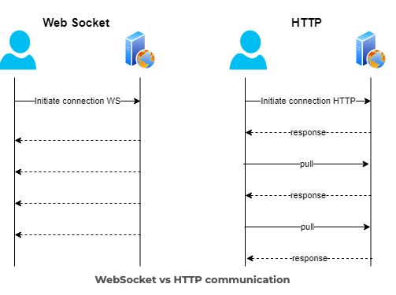

# HTTP & WebSocket 차이점

### HTTP 프로토콜

-   (단방향)클라이언트가 서버에 요청을 보내면 서버는 응답만 보낸다.
-   (stateless) 응답을 보내면 연결이 끊긴다. 누가 보냈는지 상태를 유지하기 위해서는 쿠키나 세션 등을 사용해야한다.
-   클라이언트와 서버 간 통신은 주로 브라우저-백엔드 간이지만, 백엔드-백엔드 간 통신도 가능하다.

### WebSocket 프로토콜

-   (양방향) 클라이언트가 서버에 요청을 보내면 클라이언트와 서버간에 연결이 유지되어 언제든 데이터를 주고 받을 수 있다.
-   HTTP를 기반으로 하여 Handshake 과정에서 HTTP 프로토콜을 사용하여 연결이 확립되면 WebSocket 프로토콜로 전환된다.
-   클라이언트와 서버 간 통신은 주로 브라우저-백엔드 간이지만, 백엔드-백엔드 간 통신도 가능하다.

출처 : https://ambassadorpatryk.com/2020/03/publish-web-socket-in-the-experience-layer/
