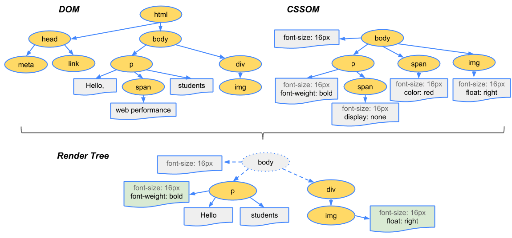

# DOM & Rendering

## DOM과 브라우저 렌더링 과정

1. `브라우저`가 사용자가 요청한 주소를 방문해 `HTML 파일을 다운로드`한다.
2. 브라우저의 `렌더링 엔진`은 HTML을 파싱해 DOM 노드로 구성된 트리(`DOM`)을 만든다.
3. 2번 과정에서 CSS 파일을 만나면 해당 `CSS 파일도 다운로드`한다.
4. 브라우저의 `렌더링 엔진`은 이 CSS도 파싱해 CSS 노드로 구성된 트리(`CSSOM`)을 만든다.
5. `브라우저는 DOM 노드를 순회한다.`(모든 노드를 방문하지 않고 사용자 `눈에 보이는 노드만 방문`한다. 즉, display : none과 같이 사용자 화면에 보이지 않는 요소는 방문해 작업하지 않는다. 이는 트리를 분석하는 과정을 조금이라도 빠르게 하기 위해서이다.)
6. 눈에 보이는 노드를 대상으로 `해당 노드에 대한 CSSOM 정보를 찾고 여기서 발견한 CSS 스타일 정보를 이 노드에 적용한다`. 
이 DOM 노드에 CSS를 적용하는 과정은 크게 두가지로 나눌 수 있다.
    - `레이아웃` : 각 노드가 브라우저 화면의 어느 좌표에 정확히 나타나야하는지 계산하는 과정, 이 레이아웃을 거치면 반드시 페인팅 과정도 거치게 된다.
    - `페인팅` : 레이아웃 단계를 거친 노드에 색과 같은 실제 유효한 모습을 그리는 과정




```javascript
// 기존 렌더링 방식(sync)
// ReactDOM.render(  
//  React.createElement('h1', null, 'A'),
//  document.getElementById('root')
// );
const root = ReactDOM.createRoot( 
  document.getElementById('root')
);
const element = <h1>Hello, world</h1>;
root.render(element);

```
* `document.getElementById('root')`은 real Dom
* `ReactDOM.createRoot`를 이용하여 virtual Dom 생성
* `render` : realDom을 virtualDom으로 렌더링


